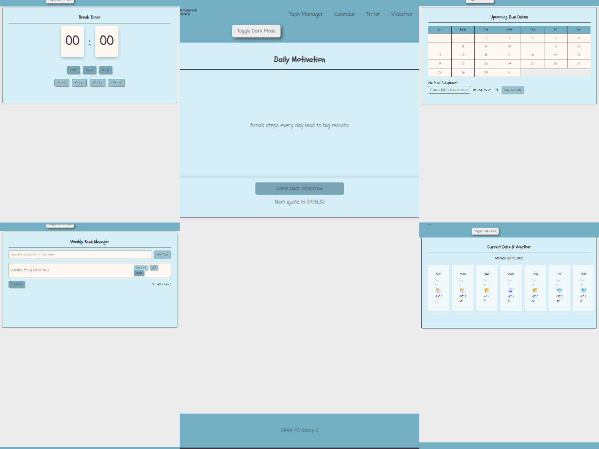

# habit-tracker
js-cpan113-group project

Gif for Group Project Phase 2: Development Phase

# Project Demo

Here is our detailed breakdown on our Habit Tracker:

# Purpose

This website is designed to help students stay productive and organized in their every day lives. It combines essential tools into one easy-to-use platform

- Stay on top of school due dates with a clear overview of assignments and deadlines.  
- Check the weather at ease so you can plan your day without switching apps.  
- Set study timers to manage your focus sessions and build healthy study habits.  
- Use the task manager to track personal and academic tasks, ensuring you stay ahead of responsibilities.
- To keep you inspired and moving forward, the website includes a Motivation Page that displays meaningful motivational quotes or messages.

By bringing these features together, the site empowers users to balance academics, personal productivity, and daily planning—all in one place.

# Access the Website

To access the website use this link: https://sahar110201.github.io/habit-tracker/

if you would like to download the webpage to Visual Studio:

In the Repository:

- Click Code
- Select "Download Zip" 

Using Visual Code Studio:

- Extract the folder and open it in Visual Studio
- Click Go Live
- Run the Website

# Team Members and their contributions:

Zlata - Frontend Developer
- Created Task Manager Design
- Created Timer Design
- Created Weather Design
- Created Logo Design for our website
- Created colors for our Dark Mode Toggle
- Created Weather JS for Weather HTML

Autumn - Frontend Developer
- Created Initial HTML and CSS Designs
- Created a design for calendar widget
- Updated themes for Motivation and Calendat HTML

Misha - JS Developer
- Created a JS for Calendar HTML
- Created generic calendar grid for Calendar HTML
- Fixed and provided troubleshooting for any issues related to Calendar JS
- Created CSS portion for the Frontend Developers to edit the Calendar grid
- Compiled a video for our Group Presentation 

Jhemuel - JS Developer
- Created JS for Timer
- Created JS for Task Manager
- Created Dark Mode JS

Sahar - Tester
- Managed GitHub Branches
- Created Habit Tracker Repo
- Added any issues, labels and milestones
- Created Project Board
- Created 7 Branches and compiled 2 pull requests
- Created JS for Motivation HTML
- Tested timer and darkmode JS

Tyler - Team Director 

# Reflection 

Here you'll find our personal reflections on the final stage 

[Reflection](https://drive.google.com/file/d/1HT-_ncOi7RxF3omCMl_vstU5dxOaiMgR/view?usp=sharing)

